# 🚀 Real-Time Crypto Streaming Analytics Platform

A production-grade cloud-native streaming analytics platform built to demonstrate modern Data Engineering, DevOps, and Distributed Systems practices using the Apache ecosystem, Kubernetes, Terraform, and AWS.

---

# 📖 Overview

The Real-Time Crypto Streaming Analytics Platform was developed as an end-to-end data engineering project to showcase how real-world organizations collect, process, monitor, and serve streaming data at scale.

The platform continuously retrieves live cryptocurrency market data from external APIs, publishes events to Apache Kafka, processes the streams using Apache Spark Structured Streaming, stores processed analytics in PostgreSQL, and exposes insights through a FastAPI-based REST API.

In addition to the streaming pipeline, the project incorporates modern cloud-native infrastructure and DevOps practices including Kubernetes orchestration, Terraform-based infrastructure provisioning, Prometheus and Grafana monitoring, CloudWatch observability, GitHub Actions CI/CD automation, and deployment on Amazon EKS.

The objective of this project is not only to build a working streaming application but also to demonstrate the architecture, tooling, and operational practices used in production-grade data platforms.

---

# 🏗️ System Architecture

```text
CoinGecko API
      │
      ▼
Crypto Producer
      │
      ▼
Apache Kafka
      │
      ▼
Apache Spark Structured Streaming
      │
      ▼
PostgreSQL
      │
      ▼
FastAPI Analytics Service
      │
      ├────────► Redis Cache
      │
      ▼
Prometheus Metrics
      │
      ▼
Grafana Dashboards

────────────────────────────

Infrastructure Layer

Terraform
      │
      ▼
AWS VPC
      │
      ▼
Amazon EKS
      │
      ▼
Kubernetes Deployments

────────────────────────────

CI/CD Layer

GitHub
      │
      ▼
GitHub Actions
      │
      ▼
Docker Images
      │
      ▼
Amazon ECR
      │
      ▼
Amazon EKS
```

---

# 🎯 Project Goals

This project was designed to demonstrate:

- Real-time data ingestion
- Event-driven architecture
- Distributed stream processing
- Cloud-native deployment
- Infrastructure as Code (IaC)
- Container orchestration
- Monitoring and observability
- CI/CD automation
- Kubernetes operations
- AWS cloud deployment

---

# 🛠️ Technology Stack

## Backend

- Python 3.11
- FastAPI

## Streaming & Data Engineering

- Apache Kafka
- Apache Spark Structured Streaming
- Apache Airflow

## Data Storage

- PostgreSQL
- Redis

## Monitoring & Observability

- Prometheus
- Grafana
- AWS CloudWatch

## Containerization & Orchestration

- Docker
- Docker Compose
- Kubernetes

## Cloud Infrastructure

- AWS EKS
- AWS ECR
- AWS VPC
- AWS CloudWatch

## Infrastructure Automation

- Terraform

## CI/CD

- GitHub Actions

---

# ✨ Key Features

### Real-Time Data Streaming

- Live cryptocurrency market data ingestion
- Event-driven architecture using Kafka
- Continuous stream processing

### Distributed Analytics Processing

- Spark Structured Streaming transformations
- Real-time analytics computation
- Streaming ETL pipeline

### Data Persistence

- PostgreSQL analytics storage
- Historical price tracking
- Queryable analytical data

### API Layer

- FastAPI REST endpoints
- Interactive Swagger documentation
- Health monitoring endpoints

### Monitoring

- Prometheus metrics collection
- Grafana dashboards
- CloudWatch log integration

### DevOps & Infrastructure

- Dockerized microservices
- Kubernetes deployments
- Infrastructure provisioning with Terraform
- Automated CI/CD workflows

---

# 📂 Project Structure

```text
crypto-streaming-platform/
│
├── api/                    # FastAPI application
├── producer/               # Crypto data producer
├── streaming/              # Spark streaming jobs
├── airflow/                # Airflow DAGs
├── infra/                  # Terraform infrastructure
├── k8s/                    # Kubernetes manifests
├── monitoring/             # Prometheus & Grafana configs
├── images/                 # Project screenshots
├── docs/                   # Documentation
├── .github/workflows/      # GitHub Actions pipelines
│
├── docker-compose.yml
├── requirements.txt
├── README.md
└── .env.example
```

---

# 🌍 Live Deployment

The platform is deployed on Amazon EKS and exposed through Kubernetes LoadBalancer services.

### Main Application

http://af47a0a3b1a06481cb61d8c60c6bf9f2-1378678979.eu-west-1.elb.amazonaws.com

### API Documentation (Swagger UI)

http://af47a0a3b1a06481cb61d8c60c6bf9f2-1378678979.eu-west-1.elb.amazonaws.com/docs

### Health Check Endpoint

http://af47a0a3b1a06481cb61d8c60c6bf9f2-1378678979.eu-west-1.elb.amazonaws.com/health

### Latest Prices Endpoint

http://af47a0a3b1a06481cb61d8c60c6bf9f2-1378678979.eu-west-1.elb.amazonaws.com/prices/latest

### Metrics Endpoint

http://af47a0a3b1a06481cb61d8c60c6bf9f2-1378678979.eu-west-1.elb.amazonaws.com/metrics

# 🌐 API Endpoints

## Root Endpoint

```http
GET /
```

Returns platform information.

---

## Health Check

```http
GET /health
```

Returns application health status.

---

## Latest Crypto Prices

```http
GET /prices/latest
```

Returns the most recent cryptocurrency prices.

---

## Historical Price Data

```http
GET /prices/{symbol}
```

Example:

```http
GET /prices/bitcoin
```

---

## Top Movers Analytics

```http
GET /analytics/top-movers
```

Returns top performing assets.

---

## Average Price Analytics

```http
GET /analytics/average-price/{symbol}
```

Returns average historical price for a symbol.

---

## Prometheus Metrics

```http
GET /metrics
```

Returns monitoring metrics.

---

# 🚀 Local Development Setup

## Clone Repository

```bash
git clone https://github.com/ayeshanajib5-cloud/crypto-streaming-platform.git

cd crypto-streaming-platform
```

---

## Start All Services

```bash
docker compose up --build
```

---

## Verify Running Containers

```bash
docker ps
```

---

# 🔗 Local Service URLs

| Service | URL |
|----------|----------|
| FastAPI | http://localhost:8000 |
| Swagger Docs | http://localhost:8000/docs |
| Prometheus | http://localhost:9090 |
| Grafana | http://localhost:3000 |
| Airflow | http://localhost:8080 |

---

# 🔐 Default Credentials

## Grafana

```text
Username: admin
Password: admin
```

## Airflow

```text
Username: admin
Password: admin
```

---

# ☸️ Kubernetes Components

The platform is deployed using Kubernetes and includes:

- Namespace isolation
- Deployments
- Services
- StatefulSets
- ConfigMaps
- Secrets
- Ingress Controller
- Health Probes
- Rolling Updates

---

# 🏗️ Infrastructure Provisioning

Terraform automates the provisioning of:

- AWS VPC
- Public & Private Subnets
- Security Groups
- IAM Roles
- Amazon EKS Cluster
- Managed Node Groups
- Amazon ECR Repositories
- CloudWatch Resources

---

# 🔄 CI/CD Pipeline

GitHub Actions automates:

### Continuous Integration

- Source code validation
- Docker image builds
- Infrastructure validation
- Kubernetes manifest validation

### Continuous Delivery

- Docker image publishing
- ECR integration
- Deployment preparation
- Infrastructure deployment workflow

---

# 📊 Monitoring & Observability

The platform includes a complete monitoring stack.

### Prometheus

Collects:

- Application metrics
- Container metrics
- Infrastructure metrics

### Grafana

Visualizes:

- API performance
- Service health
- Platform metrics
- System monitoring

### CloudWatch

Provides:

- Centralized logs
- EKS monitoring
- Container observability

---

# 📸 Project Walkthrough

## GitHub Repository

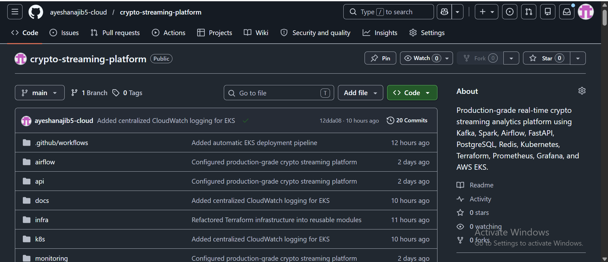

---

## CI/CD Pipeline

.png)

---

## Terraform Infrastructure

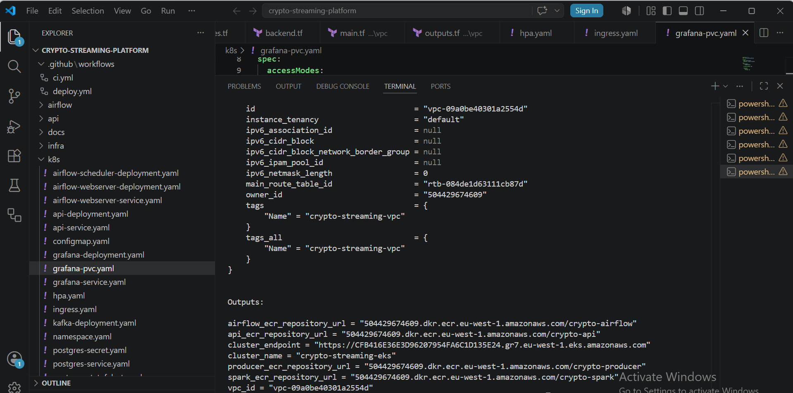

---

## Amazon EKS Cluster

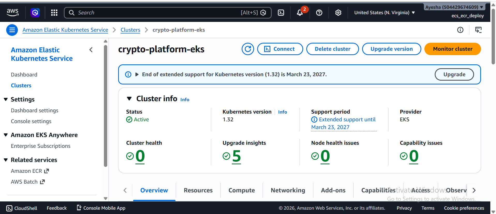

---

## EKS Worker Nodes

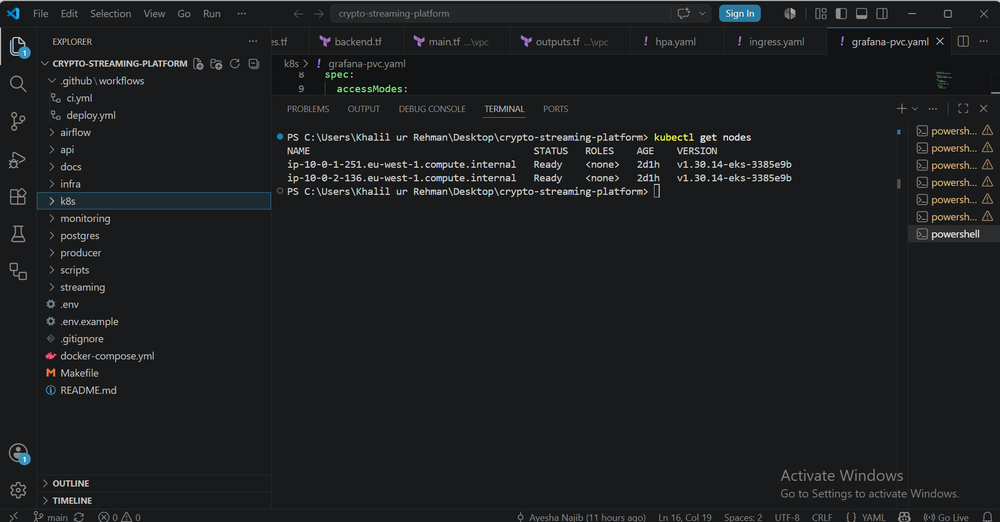

---

## Kubernetes Pods

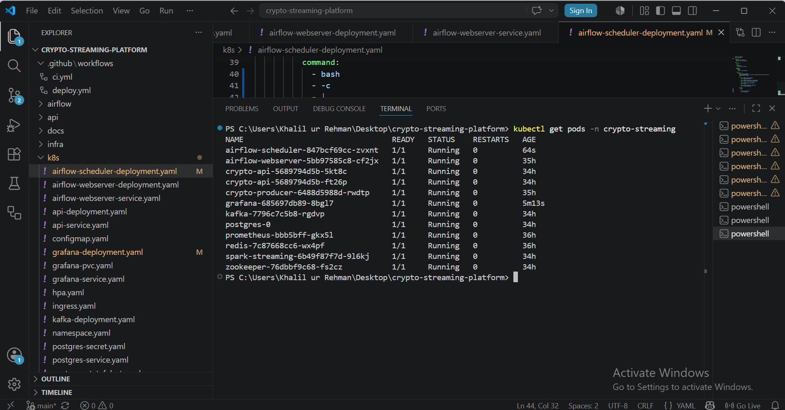

---

## Kubernetes Services

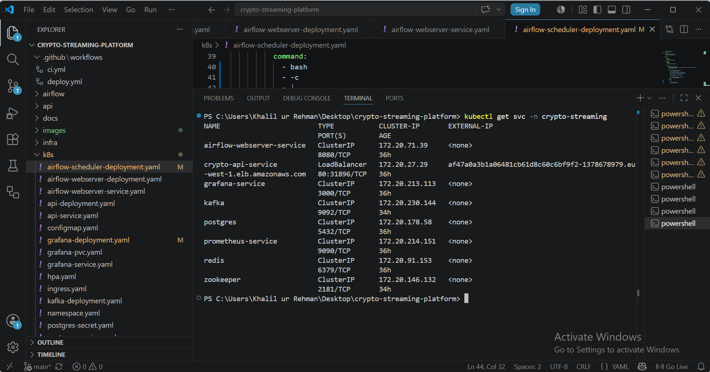

---

## Kubernetes Ingress

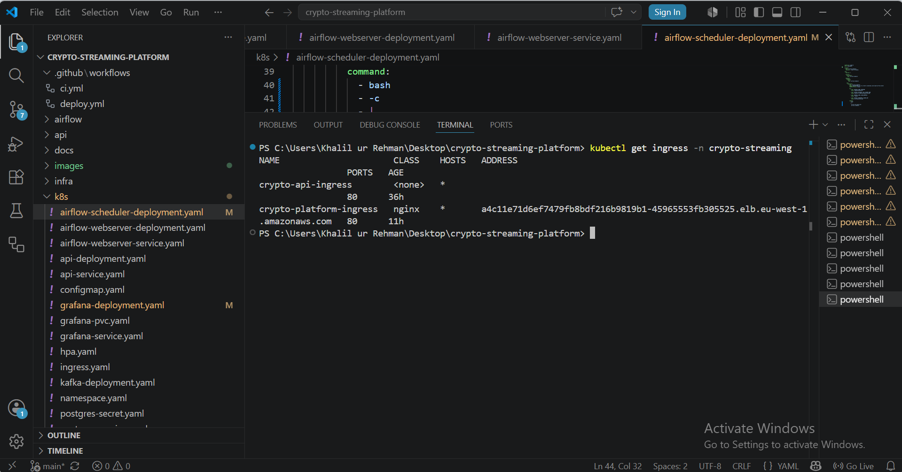

---

## FastAPI Swagger Documentation

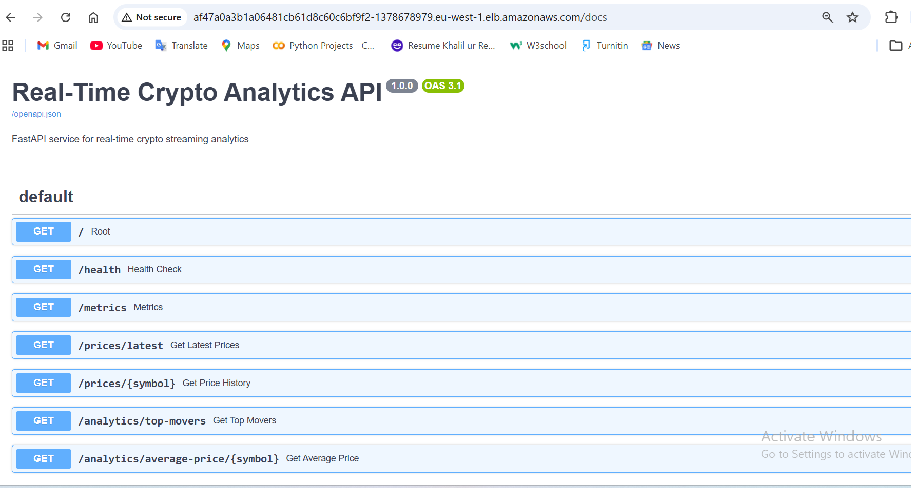

---

## FastAPI Health Endpoint

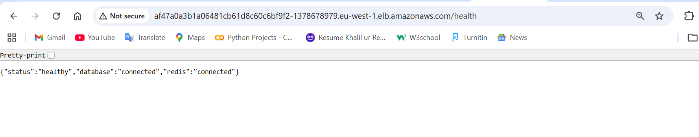

---

## FastAPI Latest Prices Endpoint

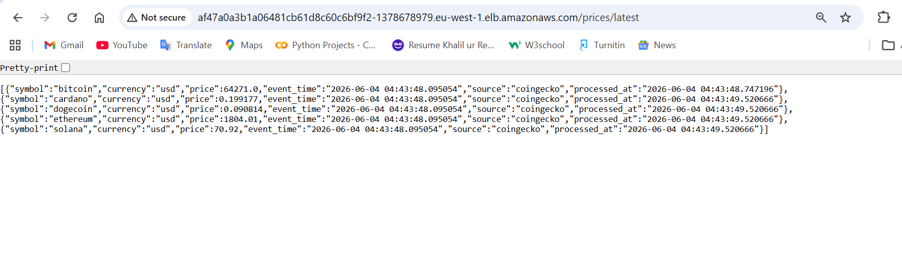

---

## Grafana Dashboard

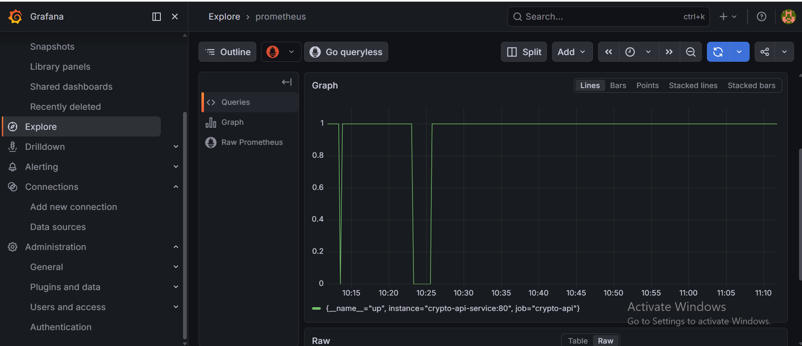

---

## Prometheus Monitoring

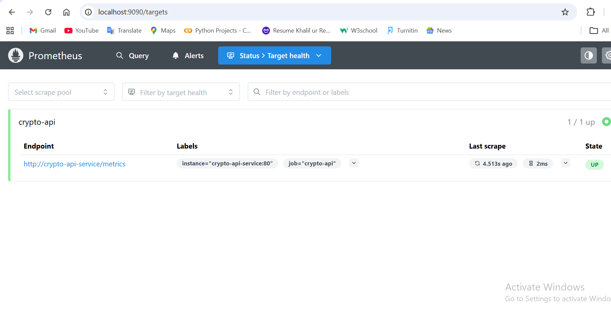

---

## Amazon ECR Repositories

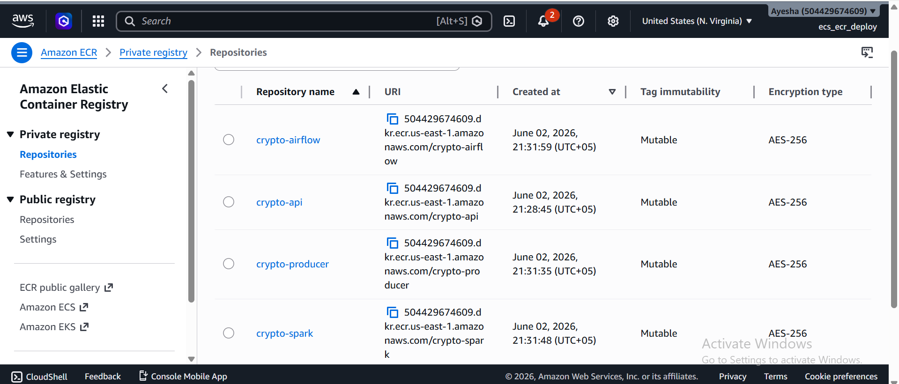

---

## AWS CloudWatch Logs

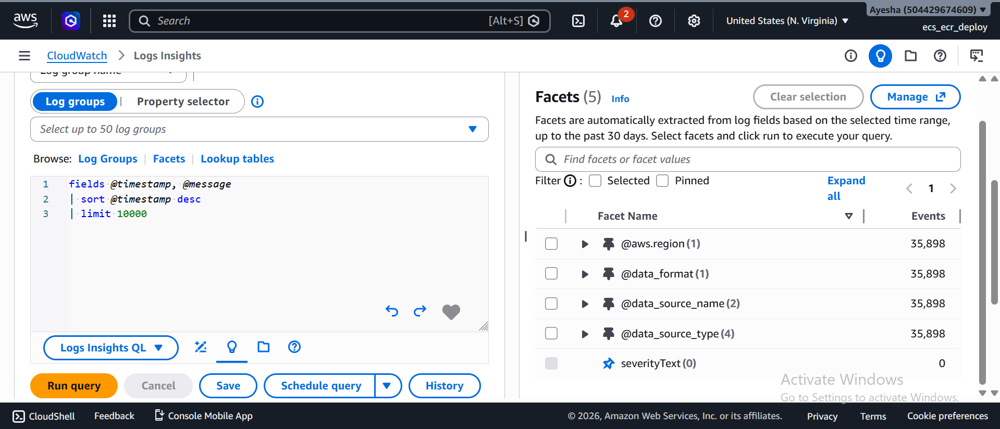

---

## Platform Architecture Diagram

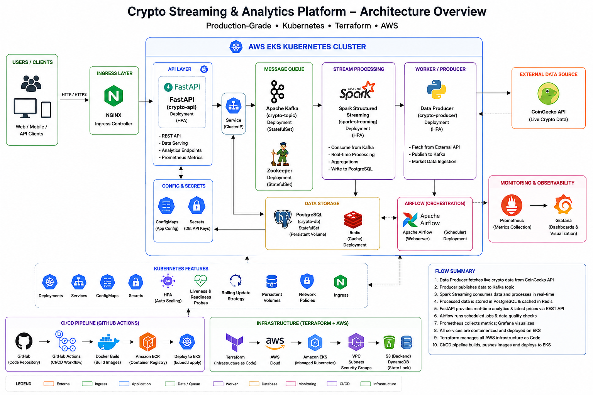

---

# 📈 Future Enhancements

Potential improvements include:

- Amazon MSK integration
- Helm-based deployments
- GitOps with ArgoCD
- Distributed Spark clusters
- Real-time anomaly detection
- WebSocket streaming
- Machine learning forecasting
- Multi-region deployment
- Advanced security hardening

---

# 👩‍💻 Author

**Ayesha Najib**

Cloud & DevOps Engineer | Data Engineering Enthusiast

This project was built to demonstrate practical experience with cloud-native infrastructure, distributed systems, real-time analytics, Kubernetes operations, infrastructure automation, and modern DevOps workflows.

---

# 📜 License

This project is intended for educational, research, and portfolio purposes.